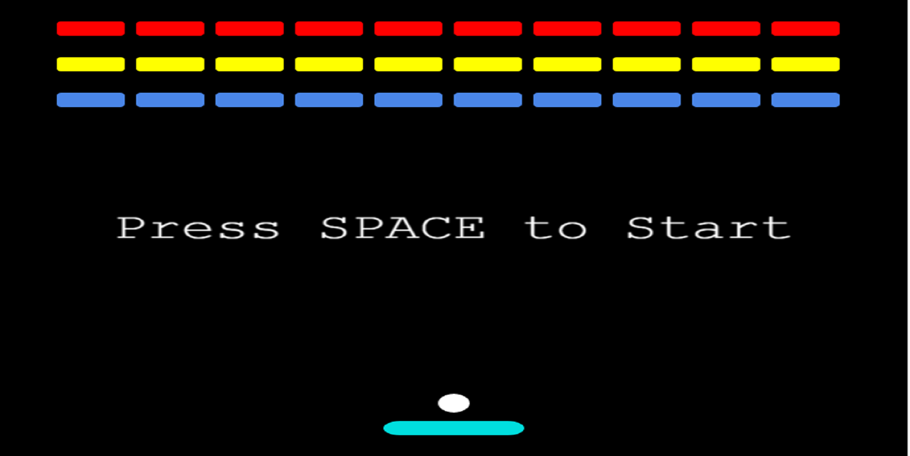

  

## Url

-   https://phaser-breakout-dd728.web.app/

## Create Project

-   yarn create react-app phaser-breakout-loom

## Install Project Dependencies

-   yarn add phaser@3.24.1

## Firebase

-   Create phaser-breakout-loom project
-   firebase login
-   firebase init
-   hosting
-   use existing project
-   pick your project
-   has to be build for react
-   y for single page app
-   n for github
-   npm run build
-   firebase deploy

## Features

-   https://phaser.io/
